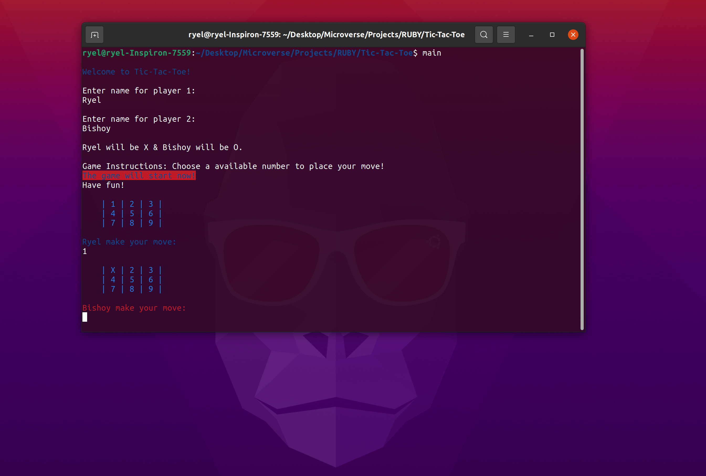

# Tic-Tac-Toe TESTING WITH

## Authors

👤 **Ryel Banfield**

- GitHub: [@RyelBanfield](https://github.com/RyelBanfield)
- Twitter: [@RyelBanfield](https://twitter.com/RyelBanfield)
- LinkedIn: [RyelBanfield](https://www.linkedin.com/in/ryel-banfield/)

👤 **Author2**

- GitHub: [@Bishoy-Samwel](https://github.com/Bishoy-Samwel)
- LinkedIn: [Bishoy Samwel](https://www.linkedin.com/in/bishoy-samwuel-ss/)
- Twitter: [@bisho](https://twitter.com/BishoFaheem15)

## 🤝 Contributing

Contributions, issues, and feature requests are welcome!

Feel free to check the [issues page](issues/).

## Show your support

Give a ⭐️ if you like this project!

## Acknowledgments

- Hat tip to anyone whose code was used
- Inspiration
- etc

## 📝 License

This project is [MIT](LICENSE) licensed.
